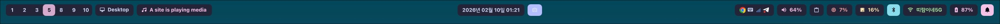

# HyprQuick

[English](./README.md) | [한국어](./README.ko.md)

A custom top bar setup for Hyprland built with QuickShell, inspired by the HyprPanel style.
It uses a left/center/right block layout and includes popup widgets (notifications, calendar + weather, WiFi, Bluetooth, CPU, screenshot, toast).

## Preview



## Features

- Workspace / Focused Window / System Tray / Volume / Notification / DateTime indicators
- Modular popup structure (`popups/`)
- Weather + calendar widget
  - WeatherAPI integration
  - KR public holiday dots (Nager API)
- Toast + notification center
- JSON-based user settings (`settings.json`)
- i18n support (`i18n/ko-KR.json`, `i18n/en-US.json`)

## Project Structure

- `shell.qml`: main entry
- `components/`: indicators, theme, i18n loader
- `popups/`: popup components
- `i18n/`: locale JSON files
- `assets/`: UI assets
- `docs/screenshots/`: README preview images
- `settings.json`: user settings

## Requirements

- Hyprland
- [QuickShell](https://quickshell.org/docs/master/)
- (Recommended) `curl` or `wget` (for weather/holiday APIs)
- (Optional) `wpctl` or `pactl` (for volume block)

## Configuration

Start by creating your local settings file from the example:

```bash
cp settings.example.json settings.json
```

`settings.json` example:

```json
{
  "general": {
    "locale": "ko-KR"
  },
  "integrations": {
    "weather": {
      "apiKey": "",
      "location": "auto:ip"
    },
    "holidays": {
      "countryCode": "KR"
    }
  },
  "theme": {
    "font": {
      "family": "SF Pro Text",
      "size": 13,
      "iconFamily": "SauceCodePro Nerd Font",
      "iconSize": 15
    }
  }
}
```

- `general.locale`: `ko-KR`, `en-US`
- `integrations.weather.apiKey`: WeatherAPI key
- `integrations.weather.location`: e.g. `auto:ip`, `Seoul`, `37.56,126.97`
- `integrations.holidays.countryCode`: holiday country code (e.g. `KR`)
- `theme.font.family`: main UI font family
- `theme.font.size`: main UI font size
- `theme.font.iconFamily`: icon font family
- `theme.font.iconSize`: icon font size
- `settings.example.json`: template file for initial setup

## i18n

Locale strings are managed in `i18n/*.json`.

- `ko-KR.json`
- `en-US.json`

To add another language:

1. Add `i18n/<locale>.json`
2. Add the locale code to `availableLocales` in `components/I18n.qml`
3. Change `general.locale` in `settings.json`

## Theming

Colors, fonts, sizes, and spacing are configured in `components/Theme.qml`.

## Reference

- QuickShell Docs: https://quickshell.org/docs/master/
- Inspiration: https://github.com/Jas-SinghFSU/HyprPanel

## TODO

1. Settings panel
